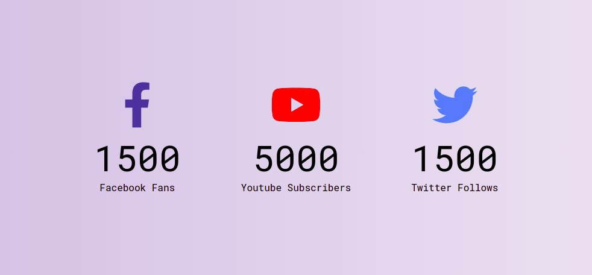

# Counter up animation

Counts up from 0 to given value.

## Features

- displays a counter-up animation

## Technologies used

- HTML
- CSS
- JavaScript

## Credits:

- Google Fonts - [Roboto Mono](https://fonts.google.com/specimen/Roboto+Mono?query=roboto+mono)
- FontAwesome icons: [fa-facebook-f](https://fontawesome.com/icons/facebook-f?s=brands), [fa-youtube](https://fontawesome.com/icons/youtube?s=brands), [fa-twitter](https://fontawesome.com/icons/twitter?s=brands)

## Preview

Live demo: [click here](https://pawelpohland.github.io/counter-up-anim/)

